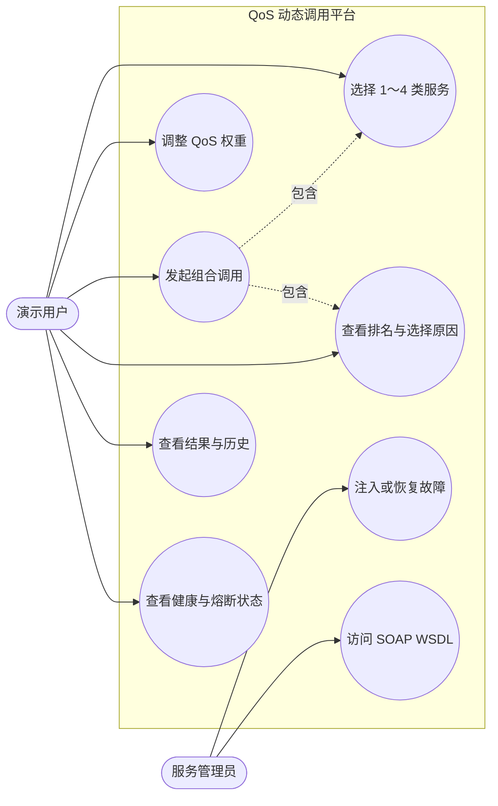
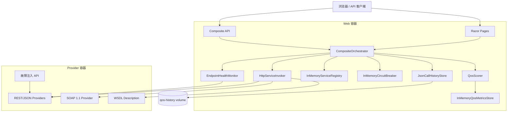
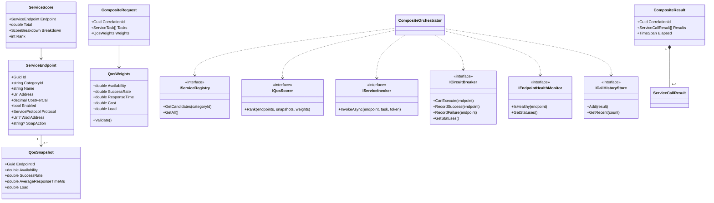
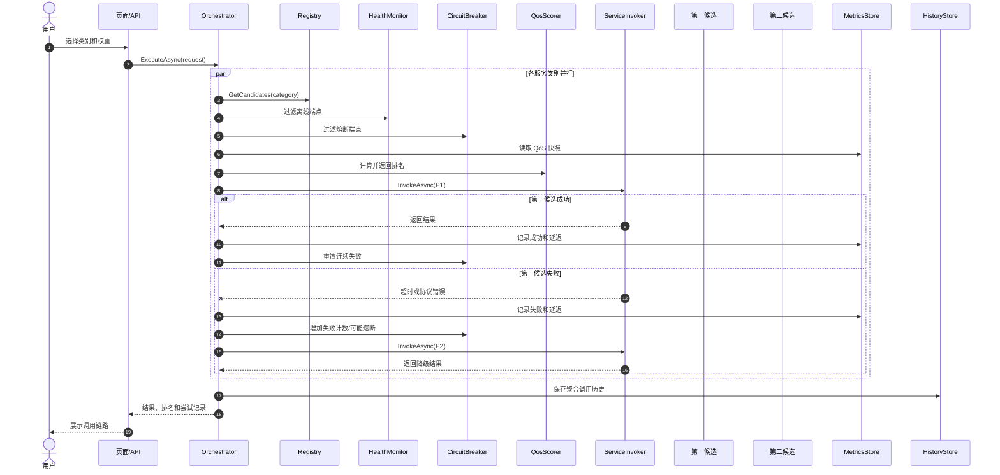
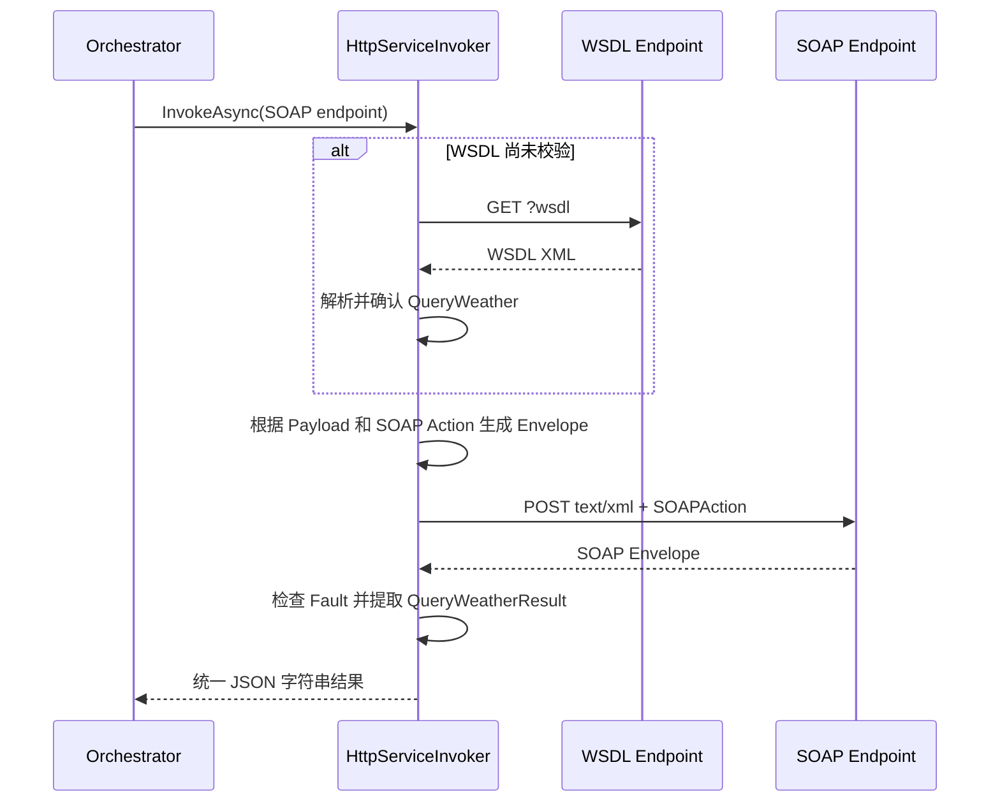
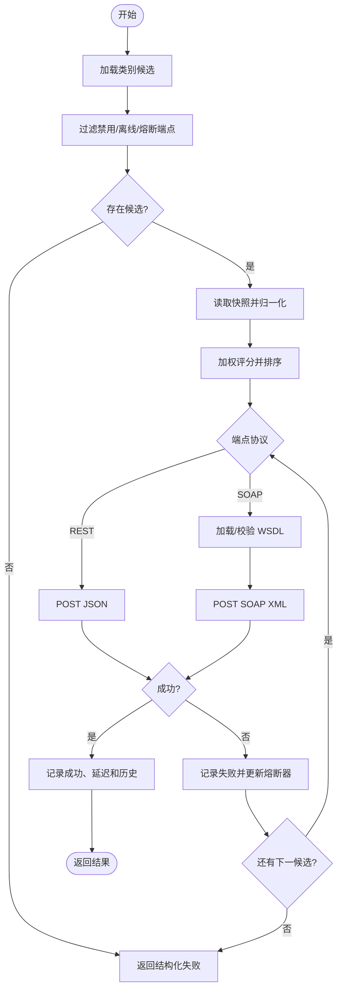
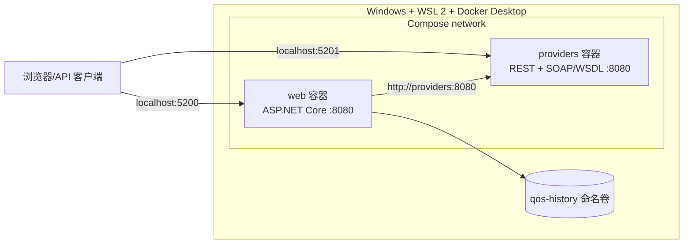

# UML 设计

以下 Mermaid 图对应当前实际实现，包括 REST、SOAP/WSDL、健康检查、熔断、历史存储和 Docker 部署。

## 1. 用例图

```mermaid
flowchart LR
    User([演示用户])
    Admin([服务管理员])

    subgraph Platform[QoS 动态调用平台]
        U1((选择 1～4 类服务))
        U2((调整 QoS 权重))
        U3((发起组合调用))
        U4((查看排名与选择原因))
        U5((查看结果与历史))
        U6((查看健康与熔断状态))
        U7((注入或恢复故障))
        U8((访问 SOAP WSDL))
    end

    User --> U1
    User --> U2
    User --> U3
    User --> U4
    User --> U5
    User --> U6
    Admin --> U7
    Admin --> U8
    U3 -.包含.-> U1
    U3 -.包含.-> U4
```

## 2. 组件图

```mermaid
flowchart TB
    Browser[浏览器 / API 客户端]

    subgraph WebContainer[Web 容器]
        UI[Razor Pages]
        API[Composite API]
        Orchestrator[CompositeOrchestrator]
        Scorer[QosScorer]
        Invoker[HttpServiceInvoker]
        Registry[InMemoryServiceRegistry]
        Metrics[InMemoryQosMetricsStore]
        Circuit[InMemoryCircuitBreaker]
        Health[EndpointHealthMonitor]
        History[JsonCallHistoryStore]
    end

    subgraph ProviderContainer[Provider 容器]
        Rest[REST/JSON Providers]
        Soap[SOAP 1.1 Provider]
        Wsdl[WSDL Description]
        Fault[故障注入 API]
    end

    Volume[(qos-history volume)]

    Browser --> UI
    Browser --> API
    UI --> Orchestrator
    API --> Orchestrator
    Orchestrator --> Registry
    Orchestrator --> Scorer
    Orchestrator --> Circuit
    Orchestrator --> Health
    Orchestrator --> Invoker
    Orchestrator --> History
    Scorer --> Metrics
    Invoker --> Rest
    Invoker --> Wsdl
    Invoker --> Soap
    Health --> Rest
    History --> Volume
    Fault --> Rest
```

## 3. 核心类图

```mermaid
classDiagram
    class ServiceEndpoint {
        +Guid Id
        +string CategoryId
        +string Name
        +Uri Address
        +decimal CostPerCall
        +bool Enabled
        +ServiceProtocol Protocol
        +Uri? WsdlAddress
        +string? SoapAction
    }

    class QosSnapshot {
        +Guid EndpointId
        +double Availability
        +double SuccessRate
        +double AverageResponseTimeMs
        +double Load
    }

    class QosWeights {
        +double Availability
        +double SuccessRate
        +double ResponseTime
        +double Cost
        +double Load
        +Validate()
    }

    class ServiceScore {
        +ServiceEndpoint Endpoint
        +double Total
        +ScoreBreakdown Breakdown
        +int Rank
    }

    class CompositeRequest {
        +Guid CorrelationId
        +ServiceTask[] Tasks
        +QosWeights Weights
    }

    class CompositeResult {
        +Guid CorrelationId
        +ServiceCallResult[] Results
        +TimeSpan Elapsed
    }

    class IServiceRegistry {
        <<interface>>
        +GetCandidates(categoryId)
        +GetAll()
    }

    class IQosScorer {
        <<interface>>
        +Rank(endpoints, snapshots, weights)
    }

    class IServiceInvoker {
        <<interface>>
        +InvokeAsync(endpoint, task, token)
    }

    class ICircuitBreaker {
        <<interface>>
        +CanExecute(endpoint)
        +RecordSuccess(endpoint)
        +RecordFailure(endpoint)
        +GetStatuses()
    }

    class IEndpointHealthMonitor {
        <<interface>>
        +IsHealthy(endpoint)
        +GetStatuses()
    }

    class ICallHistoryStore {
        <<interface>>
        +Add(result)
        +GetRecent(count)
    }

    CompositeRequest --> QosWeights
    CompositeResult "1" *-- "1..4" ServiceCallResult
    ServiceEndpoint "1" --> "0..*" QosSnapshot
    ServiceScore --> ServiceEndpoint
    CompositeOrchestrator ..> IServiceRegistry
    CompositeOrchestrator ..> IQosScorer
    CompositeOrchestrator ..> IServiceInvoker
    CompositeOrchestrator ..> ICircuitBreaker
    CompositeOrchestrator ..> IEndpointHealthMonitor
    CompositeOrchestrator ..> ICallHistoryStore
```

## 4. 动态选择与故障转移时序图

```mermaid
sequenceDiagram
    autonumber
    actor User as 用户
    participant Web as 页面/API
    participant O as Orchestrator
    participant R as Registry
    participant H as HealthMonitor
    participant C as CircuitBreaker
    participant Q as QosScorer
    participant I as ServiceInvoker
    participant P1 as 第一候选
    participant P2 as 第二候选
    participant M as MetricsStore
    participant S as HistoryStore

    User->>Web: 选择类别和权重
    Web->>O: ExecuteAsync(request)
    par 各服务类别并行
        O->>R: GetCandidates(category)
        O->>H: 过滤离线端点
        O->>C: 过滤熔断端点
        O->>M: 读取 QoS 快照
        O->>Q: 计算并返回排名
        O->>I: InvokeAsync(P1)
        alt 第一候选成功
            I-->>O: 返回结果
            O->>M: 记录成功和延迟
            O->>C: 重置连续失败
        else 第一候选失败
            I--xO: 超时或协议错误
            O->>M: 记录失败和延迟
            O->>C: 增加失败计数/可能熔断
            O->>I: InvokeAsync(P2)
            I-->>O: 返回降级结果
        end
    end
    O->>S: 保存聚合调用历史
    O-->>Web: 结果、排名和尝试记录
    Web-->>User: 展示调用链路
```

## 5. SOAP/WSDL 动态调用时序图

```mermaid
sequenceDiagram
    participant O as Orchestrator
    participant I as HttpServiceInvoker
    participant W as WSDL Endpoint
    participant S as SOAP Endpoint

    O->>I: InvokeAsync(SOAP endpoint)
    alt WSDL 尚未校验
        I->>W: GET ?wsdl
        W-->>I: WSDL XML
        I->>I: 解析并确认 QueryWeather
    end
    I->>I: 根据 Payload 和 SOAP Action 生成 Envelope
    I->>S: POST text/xml + SOAPAction
    S-->>I: SOAP Envelope
    I->>I: 检查 Fault 并提取 QueryWeatherResult
    I-->>O: 统一 JSON 字符串结果
```

## 6. QoS 选择活动图

```mermaid
flowchart TD
    Start([开始]) --> Load[加载类别候选]
    Load --> Filter[过滤禁用/离线/熔断端点]
    Filter --> Any{存在候选?}
    Any -- 否 --> Fail[返回结构化失败]
    Any -- 是 --> Normalize[读取快照并归一化]
    Normalize --> Rank[加权评分并排序]
    Rank --> Protocol{端点协议}
    Protocol -- REST --> Rest[POST JSON]
    Protocol -- SOAP --> Wsdl[加载/校验 WSDL]
    Wsdl --> Soap[POST SOAP XML]
    Rest --> Success{成功?}
    Soap --> Success
    Success -- 是 --> Record[记录成功、延迟和历史]
    Success -- 否 --> Failure[记录失败并更新熔断器]
    Failure --> More{还有下一候选?}
    More -- 是 --> Protocol
    More -- 否 --> Fail
    Record --> Done([返回结果])
```

## 7. Docker 部署图

```mermaid
flowchart LR
    Browser[浏览器/API 客户端]

    subgraph Windows[Windows + WSL 2 + Docker Desktop]
        subgraph Network[Compose network]
            Web[web 容器<br/>ASP.NET Core :8080]
            Providers[providers 容器<br/>REST + SOAP/WSDL :8080]
        end
        Volume[(qos-history 命名卷)]
    end

    Browser -->|localhost:5200| Web
    Browser -->|localhost:5201| Providers
    Web -->|http://providers:8080| Providers
    Web --> Volume
```

